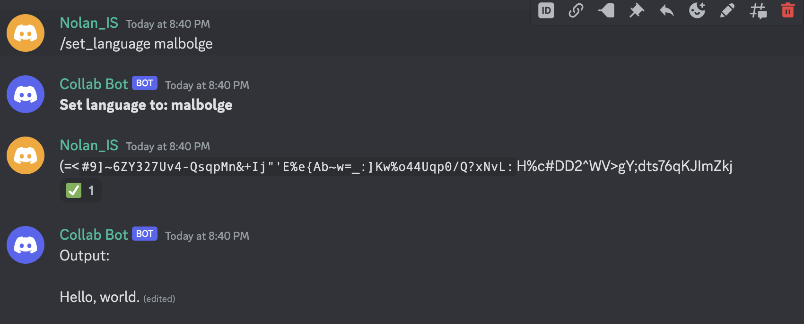

<br />
<div align="center">
<h3 align="center">Discord-Collab</h3>

  <p align="center">
    An early prototype for a collaborative coding interface accessible through a Discord chat.
    </p>
</div>


<!-- ABOUT THE PROJECT -->
## About The Project

Discord-Collab allows members of a Discord server to share snippets of code, compile and run them, and then output the result without having to use any external tools.

This allows users to share and demonstrate their code with friends and colleagues.

Discord is already very accessible, with a web app, desktop apps, and phone apps.  


## Objective

While sharing small code snippets, such as SQL Queries, with friends and classmates, we often transfer them over Discord.
Usually, we know each-other's Discord information, or are at least members of the same Server.

Copying and pasting into our own environment is usually faster than hosting it with a service such as Google Colaboratory.
This doesn't work for sharing code snippets with people who don't have their own environments set up, or are using a phone.

If we are already sharing code using Discord, why not run it and print the output inside the same messaging thread? 
This prototype aims to experiment with this idea and determine the obstacles that would need to be overcome in order to make this possible.


<!-- GETTING STARTED -->
## Setup

This discord bot is programmed in Python using discord.py. It requires a python environment with discord.py
installed, as well as a discord application created through the Discord developer portal. Interacting with the Discord bot also required a Discord account.

### Steps

* Make a clone of the Discord-Collab Prototype repository.

* Create a Discord Application on the Discord Developer Portal
* Copy your Bot's private token to "DISCORD_TOKEN" in the .env file.
* Install discord.py, dotenv, and SQLAlchemy into your Python environment. This can be done using pip:
  ```sh
  pip install discord.py
  pip install python-dotenv
  pip install SQLAlchemy
  ```
* Start the bot by running startup.py
    ```sh 
  python startup.py
  ```


<!-- USAGE EXAMPLES -->
## Usage

Blocks of code (Code Cells) are sent over Discord as a normal chat message. 
Compiling/Running code, as well as other actions, are performed by reacting to a message with certain emojis.


A list of all actions and indicators can be found by using the ```/actions``` command.

A list and description of all commands can be found by using the ```/help``` command.

### Adding a language to Discord-Collab

Language runtimes are located in the _Langs_ directory. All runtimes extend the ```CodeEntrance/a_language_driver``` 
abstract class. The children classes must override the ```compile``` and ```run_compiled_cell``` methods. 
Classes that extend a_language_driver located inside the Langs folder are detected automatically.

There are currently four "language" runtimes implemented. Two of them are used for testing: 

* **echo_test:** Tests the input stream functionality by printing anything that is inputted.
* **concurrency_test:** Tests concurrently executing code cells by perpetually printing messages.
* **sqlite3:** A very simple sqlite3 runtime that defers to Python's sqlite3 interface.
* **malbolge:** A simple, but fun, implementation of Ben Olmstead's esoteric programming language. 
Based on Hunmin Park's pyMalbolge, and the Malbolge wikipedia page. 
_This runtime in particular revealed some issues that are discussed below._

## Conclusions

It became very clear while building this prototype that it will be difficult to make a system like this user-friendly.
This is due to several limitations by Discord:

* **Messages can only be edited by it's author.** 
This means that if a user wants to make a slight modification to another user's code snippet, they will have to copy and paste the entire message. This applies to bots as well.

* **Messages can only be sent chronologically.** Since new messages cannot be added in-between other messages, 
this means Output Cells cannot always be inserted below their associated Code Cell.
* **Code Cells are difficult to stylize.** Discord allows messages to be stylized in a way that would allow syntax highlighting.
But since a Discord Bot can only modify their own messages, they can not stylize a user's Code Cell.
* **Discord uses special characters for stylizing.** Any Code Cell that contains these characters will still function, but will not look accurate. 
This becomes obvious in languages that excessively use these characters, like Malbolge.




## Future Plans

All of these issues can be solved by moving control of the Code Cells over to the Discord Bot.
If all Code Cells are authored by the same Bot, then several things are possible: Cells can be stylized, special characters can be escaped, 
and message contents can be swapped between themselves.

This does introduce another issue that could reduce user-friendliness. Code Cells can only be added, 
removed, and edited in an indirect fashion since the Bot must be the one to make these changes.

This, along with a few new features, is something I will want to explore in a future prototype:
- [ ] Replacing the current Code Cell manipulation methods with this alternative method.
- [ ] Implementing execution history options.
- [ ] Experimenting with the usage of multiple Guilds, Channels, and Roles.
    - [ ] Should they all use the same runtimes?
    - [ ] Should Code Cells and Output cells be limited to a certain Channel?
    - [ ] Should only members with specific Roles be allowed to perform certain actions?


Ultimately, I feel the current method of Cell Management is too unfriendly to users, which is why I stopped adding features to this prototype.
When I return to this project, I will want to incorporate a more user-friendly design before adding more features.


## Links & References

* [Google Collaboratory](https://colab.research.google.com): The Jupyter-Notebook style of collaborate coding, where code snippets are seperated into individually executable "Cells", inspired much of this project. 
* [Hunmin Park, pyMalbolge](https://github.com/Avantgarde95/pyMalbolge): This simple implementation of Malbolge in Python was used as a reference for implementing the Malbolge language.
* [Malbolge Wikipidea](https://en.wikipedia.org/wiki/Malbolge): This Wikipidea page clearly defined Malbolge and how Malbolge code is handled.
* [Discord Developer Portal](https://discord.com/developers/): This is the webpage where Discord Applications can be created.


[license-url]: LICENSE.txt
[product-screenshot]: images/sqlite3_example.png
[actions-screenshot]: images/actions.png
[malbolge-screenshot]: images/malbolge_formating.png
